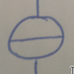

# Hand-Drawn Electrical Circuit Diagram Contribution Guideline

## Thank you!

Hello and thank you that you consider to contribute to my dataset of hand-drawn electrical circuits for my masterthesis.

The aim of my thesis is to convert those drawings into a digital format (LTSpice). To recognize components and the circuits itself, I want to take advantage of deep learning methods. As you probably know to train a network I need data. This is where you come in!

I will make the dataset public after my thesis. So not only are you helping me, but you are helping to contribute to the biggest publicly available dataset of hand-drawn electrical circuits.

## Status Quo

- 140 drawings
- 20 different persons

## EMail

Please send the images to:

dmitrij.vinokour@fau.de

## Rules and constraints

### 1. Allowed Symbols (without the cursor)

Resistor

Inductor

Capacitor

Diode

Ground

Voltage Source

Current Source

For sources please additionally use an arrow to indicate the flow.

### 2. Wire Constraint

- Please use only horizontal and vertical wires (small angles are allowed)
- Crosses in wires are allowed
- Skip connections are not allowed

### 3. Annotations

- Use only horizontal annotations
- Annotation text can be left, right, top or bottom of a component

### 4. Different paper backgrounds

- White paper
- Grid paper

It would be great to have some circuits drawn on grid paper and on white paper. From the white paper a mask will be created which can then be projected on gridded backgrounds again to augment the dataset.

### 6. Colors and Pencil

- Black
- Blue
- Graphit Pencil (Bleistift)
- Thick and thin pencils allowed

### 7. General

- A drawing with your left hand is appreciated
- Try to make the used components somewhat equally distributed through the circuit or at least your submission
- Please do not use more than 5 components in parallel

## Examples

